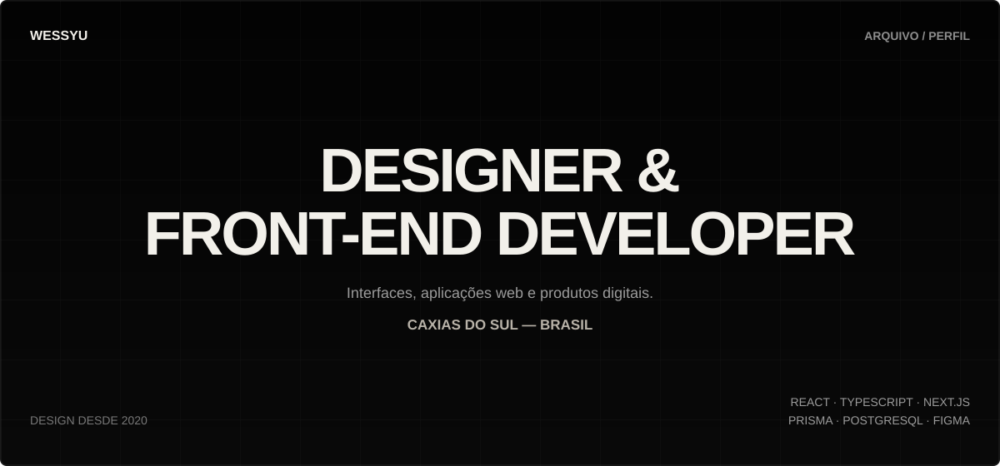

  

  <a href="https://wessyu-arquivo.vercel.app/"><b>PORTFÓLIO</b></a>
  &nbsp;&nbsp;·&nbsp;&nbsp;
  <a href="https://www.linkedin.com/in/wesley-santos-cruz-b57589213/"><b>LINKEDIN</b></a>
  &nbsp;&nbsp;·&nbsp;&nbsp;
  <a href="mailto:wess.c@proton.me"><b>E-MAIL</b></a>

---

## 01 / PERFIL

Designer desde 2020 e desenvolvedor front-end desde 2023.

Aprendi desenvolvimento para não deixar minhas ideias presas no layout. Hoje construo interfaces e aplicações completas, unindo **direção visual, experiência, responsividade e implementação técnica**.

Atualmente, estou disponível para oportunidades como **Desenvolvedor Front-End Júnior**.

`CAXIAS DO SUL — RS, BRASIL`

---

## 02 / TRABALHOS SELECIONADOS

### 01 — RECEITAS

Aplicação full stack para publicar, buscar, salvar e administrar receitas. Inclui autenticação, sessões, favoritos, comentários, filtros, upload de imagens e painel administrativo.

**NEXT.JS · TYPESCRIPT · PRISMA · POSTGRESQL**  
[VER PROJETO](https://receitas-delta-eight.vercel.app) · [VER CÓDIGO](https://github.com/WessYu/Receitas)

 

### 02 — DEVMATCH

Plataforma de recrutamento técnico com perfis separados para empresas e desenvolvedores, compatibilidade por stack, matches persistidos, feed e chat contextual.

**NEXT.JS · TYPESCRIPT · NEON · POSTGRESQL**  
[VER PROJETO](https://devmatch-neon.vercel.app) · [VER CÓDIGO](https://github.com/WessYu/DEVMATCH)

 

### 03 — LOGIC QUEST

Plataforma de estudo de lógica com módulos, prática guiada, checkpoints, XP, progresso persistente no navegador e instalação como PWA.

**JAVASCRIPT · LOCALSTORAGE · PWA · RESPONSIVE UI**  
[VER PROJETO](https://wessyu.github.io/Logic-quest/) · [VER CÓDIGO](https://github.com/WessYu/Logic-quest)

---

## 03 / STACK

**FRONT-END**  
React · TypeScript · JavaScript · Next.js · HTML · CSS · Tailwind CSS

**BACK-END & DADOS**  
Node.js · Prisma · PostgreSQL · APIs REST · Autenticação

**DESIGN & ENTREGA**  
Figma · Direção visual · Interfaces responsivas · Git · GitHub · Vercel

---

## 04 / CONTATO

Busco oportunidades para trabalhar com front-end, interfaces e produtos digitais.

**Portfólio:** [wessyu-arquivo.vercel.app](https://wessyu-arquivo.vercel.app/)  
**LinkedIn:** [wesley-santos-cruz](https://www.linkedin.com/in/wesley-santos-cruz-b57589213/)  
**E-mail:** [wess.c@proton.me](mailto:wess.c@proton.me)
